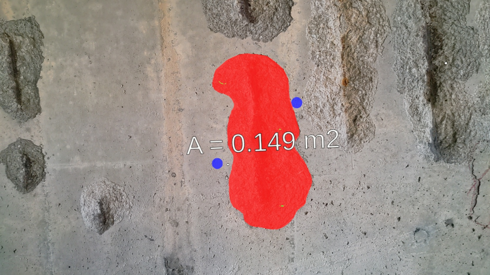

    
    
<br /><br /><br /><br /><br /><br />
    
    

### [CVISS Research](http://www.cviss.net/)

## Interactive Defect Quantification through Extended Reality

[](https://www.youtube.com/watch?v=vOv0GKCy_r0)

### Introduction

This repository contains the source code used by the authors to run Extended Reality Inspection and Visualization (XRIV) developed for the [paper](https://www.sciencedirect.com/science/article/abs/pii/S1474034621002238),

Al-Sabbag, Z. A., Yeum, C. M., & Narasimhan, S. (2022). Interactive defect quantification through extended reality. *Advanced Engineering Informatics*, *51*, 101473.

XRIV allows you to perform interactive segmentation on objects of interest (defects such as spalling, cracks, etc.) and measure their areas automatically. XRIV was implemented on Microsoft's HoloLens 2.

### Deployment

XRIV requires an XR device (HoloLens 2) and a local computer (server) for deployment. 

### Installation and Building From Source

#### Server

First, recursively clone this package:

```
git clone --recursive https://github.com/cviss-lab/XRIV.git
```

Then install the dependencies listed in the **requirements.txt** in the **server** folder.

To deploy the server, run the following:

```
cd server
python server.py 
```
When prompted, enter the **IP address** of the HoloLens 2 device on your local network.

#### HoloLens 2

The unity project was built using **Unity 2020.3.24f1**. 

To deploy the project on your device, use *File -> Build Settings -> Build* on the Universal Windows Platform (UWP) and select a place to store the build. Then, open the resulting *XRIV.sln* on Visual Studio 2019 and deploy it to your device using USB or Wi-Fi. 

Once the application starts, enter the *IP address* and *Port* of the server. You can select positive and negative seed points by selecting their option in the menu, and then click on the location to place them. Then, use *Analyze Image* and click to capture an image and send it to the server for analysis.



## License

The code is released under the MPL 2.0 License. MPL is a copyleft license that is easy to comply with. You must make the source code for any of your changes available under MPL, but you can combine the MPL software with proprietary code, as long as you keep the MPL code in separate files.

### BibTeX Citations

If you use any of our code, please cite our paper and the original [f-BRS](https://github.com/saic-vul/fbrs_interactive_segmentation) paper as:

```
@article{al2022interactive,
  title={Interactive defect quantification through extended reality},
  author={Al-Sabbag, Zaid Abbas and Yeum, Chul Min and Narasimhan, Sriram},
  journal={Advanced Engineering Informatics},
  volume={51},
  pages={101473},
  year={2022},
  publisher={Elsevier}
}
@inproceedings{fbrs2020,
   title={f-brs: Rethinking backpropagating refinement for interactive segmentation},
   author={Sofiiuk, Konstantin and Petrov, Ilia and Barinova, Olga and Konushin, Anton},
   booktitle={Proceedings of the IEEE/CVF Conference on Computer Vision and Pattern Recognition},
   pages={8623--8632},
   year={2020}
}
```
